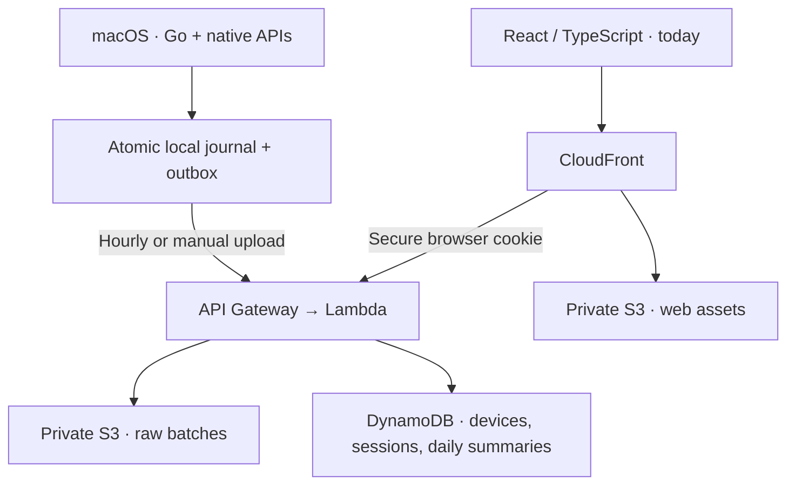

# nemu

nemu records foreground application identity and time on macOS, keeps a durable local buffer, and syncs hourly to a paired browser dashboard.

[Open the live dashboard](https://d1z5giweildfo4.cloudfront.net/) — pair it with the macOS agent to view your own activity.

## Video Demo


## What v1 implements

- A Go macOS menu-bar process using NSWorkspace, native input inactivity, and sleep/wake notifications.
- Foreground app sessions; five-minute retroactive idle detection; separate idle intervals; excluded sleep time.
- An atomic private local journal, crash recovery, and a durable upload outbox.
- Hourly uploads, manual **Sync now** from the dashboard or menu bar, and retry-safe batch identities.
- Device credentials in Keychain and short-lived, single-use browser pairing. No email or password.
- AWS ingestion, private S3 raw archives, DynamoDB records and derived calendar summaries.
- A React dashboard with Today and Settings, top apps, timeline, and loading/empty/error states.
- A launch-at-login installer and reproducible Terraform configuration.

**Release status:** the dashboard and API are live as a hosted developer preview. The macOS agent is built from source; a signed/notarized installer is not included yet.

## Architecture



Raw sessions remain the source of truth during their retention period. Calendar summaries are derived in the browser’s IANA timezone, including 23- and 25-hour daylight-saving days. Background apps receive no active time.

Detailed documentation:

- [Architecture and access patterns](docs/architecture.md)
- [Activity semantics](docs/activity.md)
- [Security and retention](docs/security.md)
- [AWS deployment and verification](docs/deployment.md)

## Local development

Requirements: Node.js 22.12+, Go 1.24+, and macOS with Xcode command-line tools for the native executable. Terraform 1.6+ and configured AWS credentials are needed only for deployment.

```sh
npm ci
npm run dev -w backend
# In another terminal:
npm run dev -w web -- --host localhost
```

Open **http://localhost:5173**. Vite forwards `/api` to the local service on port 8787. It begins unpaired and stores local development records under the ignored `.scratch/local-backend` directory. It does not seed any activity or connect to AWS. Use `localhost`, rather than an IP address, for local cookie behavior. The local adapter is a single-process development service, not a production server; cloud lifecycle cleanup is not emulated.

The native process requires HTTPS. To test it against the local API, put a locally trusted HTTPS reverse proxy in front of Vite and set the development service’s origin accordingly (`DEV_WEB_ORIGIN`). Otherwise, point it at your deployed CloudFront URL.

### Checks

```sh
npm run check
npm test
npm run build
npm run format:check
cd agent
go test -race ./...
go vet ./...
go build -o nemu ./cmd/nemu
```

The suites exercise idle rollback, brief switches, crash persistence, retries, pairing concurrency/expiry, authorization, validation, DST, day clipping, and the main dashboard states. Synthetic records exist only inside tests.

## Try the hosted demo on macOS

Clone this repository, then build and run the menu-bar agent against the hosted Nemu dashboard:

```sh
git clone https://github.com/ansonnchan/nemu.git
cd nemu/agent
go build -o nemu ./cmd/nemu
NEMU_URL=https://d1z5giweildfo4.cloudfront.net ./nemu
```

The first successful registration opens a private pairing link. You can also choose **Pair this browser** from the nemu menu-bar item. The link expires after ten minutes and works once. Your browser never receives the permanent device secret.

Menu actions: **Open nemu**, **Sync now**, **Pause / Resume**, **Pair this browser**, **Quit**. The dashboard can also request a sync; the running agent consumes that one-time request and uses the same durable upload path. The menu shows recording state and last sync age. Pausing persists across restarts. If Keychain is locked, unlock it and restart; existing credentials are preserved.

The journal lives in `~/Library/Application Support/nemu`, with a single-process lock and private file permissions. The secret lives in the `app.nemu.agent` Keychain service. Keep the journal and its corresponding Keychain item together when migrating. Do not edit queued batches by hand.

### Launch at login

From the repository root, after building:

```sh
NEMU_URL=https://d1z5giweildfo4.cloudfront.net ./scripts/install-agent.sh
```

To disable login launch and stop that installed process:

```sh
launchctl bootout "gui/$(id -u)" "$HOME/Library/LaunchAgents/app.nemu.agent.plist"
```

The installer keeps the small process in Application Support. Running the executable directly and through launchd simultaneously is prevented by the journal lock. There is no in-menu login toggle in this version.

## Technology

| Layer | Technology | Role |
| --- | --- | --- |
| macOS agent | Go, Objective-C, cgo | Foreground-app sampling, native idle detection, sleep/wake events, and the menu-bar UI |
| Local state | Atomic JSON journal, macOS Keychain | Crash-safe activity queue and protected device credentials |
| Dashboard | React, TypeScript, Vite | Daily summaries, app rankings, timeline, pairing, and manual sync requests |
| API | AWS Lambda, API Gateway | Device registration, authenticated uploads, pairing, and browser queries |
| Storage | Amazon S3, DynamoDB | Short-lived raw batches, device records, sessions, and daily summaries |
| Delivery | CloudFront | HTTPS delivery for the dashboard and same-origin API |
| Infrastructure | Terraform | Reproducible AWS provisioning and lifecycle configuration |

## V2

| Status | Area | Direction |
| --- | --- | --- |
| Current | macOS | Complete the v1 developer preview and package a signed, notarized installer |
| Coming | Windows | Add an isolated native platform adapter while preserving the same activity semantics |
| Coming | Linux | Add a desktop-aware platform adapter and retain the shared journal and sync model |
| Planning | Chrome extension | Optionally distinguish sites such as YouTube and Wikipedia while Chrome is foreground, without collecting page content or input values |
