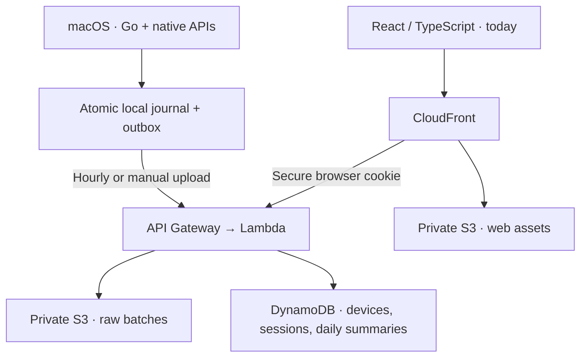

# nemu

nemu records foreground application identity and time on macOS (for now), keeps a durable local buffer, and syncs hourly to a paired browser dashboard.

## A quieter dashboard

The web experience uses warm ivory surfaces, soft sage accents, and dedicated anime artwork in the hero. New devices begin with an empty journal. There is no demo dataset.

<!-- Screenshot slot: replace this artwork with a screenshot of your own empty dashboard. -->


## What v1 implements

- A Go macOS menu-bar process using NSWorkspace, native input inactivity, and sleep/wake notifications.
- Foreground app sessions; five-minute retroactive idle detection; separate idle intervals; excluded sleep time.
- An atomic private local journal, crash recovery, and a durable upload outbox.
- Hourly uploads, manual **Sync now** in the menu bar, and retry-safe batch identities.
- Device credentials in Keychain and short-lived, single-use browser pairing. No email or password.
- AWS ingestion, private S3 raw archives, DynamoDB records and derived calendar summaries.
- A React dashboard with Today and Settings, top apps, timeline, and loading/empty/error states.
- A launch-at-login installer and reproducible Terraform configuration.

**Release status:** source builds and automated tests are included. AWS deployment and a real-device sleep/wake endurance test are still release acceptance steps. The executable is a developer build; a signed/notarized installer is not included.

## Architecture



Raw sessions remain the source of truth during their retention period. Calendar summaries are derived in the browser’s IANA timezone, including 23- and 25-hour daylight-saving days. Background apps receive no active time.

Read [architecture and access patterns](docs/architecture.md), [activity semantics](docs/activity.md), and [security and retention](docs/security.md).

## Local development

Requirements: Node.js 22.12+, Go 1.24+, and macOS with Xcode command-line tools for the native executable. Terraform 1.6+ and configured AWS credentials are needed only for deployment.

```sh
npm ci
npm run dev -w backend
# In another terminal:
npm run dev -w web -- --host localhost
```

Open **http://localhost:5173**. Vite forwards `/api` to the local service on port 8787. It begins unpaired and stores local development records under the ignored `.scratch/local-backend` directory. It does not seed any activity or connect to AWS. Use `localhost`, rather than an IP address, for local cookie behavior. The local adapter is a single-process development service, not a production server; cloud lifecycle cleanup is not emulated.

The native process requires HTTPS. To test it against the local API, put a locally trusted HTTPS reverse proxy in front of Vite and set the development service’s origin accordingly (`DEV_WEB_ORIGIN`). Otherwise, point it at your deployed CloudFront URL.

### Checks

```sh
npm run check
npm test
npm run build
npm run format:check
cd agent
go test -race ./...
go vet ./...
go build -o nemu ./cmd/nemu
```

The suites exercise idle rollback, brief switches, crash persistence, retries, pairing concurrency/expiry, authorization, validation, DST, day clipping, and the main dashboard states. Synthetic records exist only inside tests.

## Run on macOS

```sh
cd agent
go build -o nemu ./cmd/nemu
NEMU_URL=https://YOUR_CLOUDFRONT_DOMAIN ./nemu
```

The first successful registration opens a private pairing link. You can also choose **Pair this browser** from the nemu menu-bar item. The link expires after ten minutes and works once. Your browser never receives the permanent device secret.

Menu actions: **Open nemu**, **Sync now**, **Pause / Resume**, **Pair this browser**, **Quit**. The menu shows recording state and last sync age. Pausing persists across restarts. If Keychain is locked, unlock it and restart; existing credentials are preserved.

The journal lives in `~/Library/Application Support/nemu`, with a single-process lock and private file permissions. The secret lives in the `app.nemu.agent` Keychain service. Keep the journal and its corresponding Keychain item together when migrating. Do not edit queued batches by hand.

### Launch at login

From the repository root, after building:

```sh
NEMU_URL=https://YOUR_CLOUDFRONT_DOMAIN ./scripts/install-agent.sh
```

To disable login launch and stop that installed process:

```sh
launchctl bootout "gui/$(id -u)" "$HOME/Library/LaunchAgents/app.nemu.agent.plist"
```

The installer keeps the small process in Application Support. Running the executable directly and through launchd simultaneously is prevented by the journal lock. There is no in-menu login toggle in this version.

## AWS deployment

See the [deployment guide](docs/deployment.md). Nothing deploys as part of `npm install`, tests, or builds.

```sh
npm run build
cd infrastructure
terraform init
terraform plan
# Review the resources and costs, then deploy with your configured AWS identity:
terraform apply
```

Upload `web/dist` to the output web bucket as described in the guide. CloudFront serves the dashboard and API from one origin. Configure `NEMU_URL` using the `web_url` output.

## Privacy

nemu collects application names/bundle IDs, UTC interval boundaries, and idle state. It never collects screenshots, keystrokes, clipboard contents, messages, documents, URLs, page titles, browser history, or window contents.

Detailed cloud activity expires after 30 days from ingestion. Saved aggregate summaries expire after one year from their creation. Timelines are not stored in the long-lived summary cache. AWS expiry cleanup is eventual. Pending local data remains until acknowledged, so long network outages do not silently discard a day.

## Known limitations

- A long video without input can appear idle after five minutes. Media detection is intentionally absent.
- Foreground polling runs once per second; faster transitions may not be observed.
- The most recent five minutes stay local until their idle boundary is settled. Manual sync uploads settled time, not provisional activity.
- The hosted view is eventually consistent. It refreshes on browser focus and every five minutes; uploads remain hourly.
- Sleep/wake integration compiles against native APIs but requires manual real-device validation before release. Missed run-loop gaps over ten seconds are conservatively treated as unobserved time.
- Only previously viewed daily aggregates remain after detailed records expire. Historical data in a previously unused timezone cannot be reconstructed after raw retention.
- Local clock changes backward stop accepting samples until chronological time resumes. No time is invented to bridge the gap.
- One macOS user session and one device per paired browser are supported. Browser sessions expire after 30 days; disconnect clears the local cookie.
- Terraform has not been applied to an AWS account as part of source development. There is no signed installer, automatic update system, or hosted public download.

## Technology

Go · Objective-C/cgo · React · TypeScript · Vite · Lambda · API Gateway · S3 · DynamoDB · CloudFront · Terraform.

Fonts and the dashboard’s hero illustration are bundled locally under `web/public/assets`.

## V2

1. Chrome extension for domain/tab activity while Chrome is foreground.
2. Windows support.
3. Linux support.
