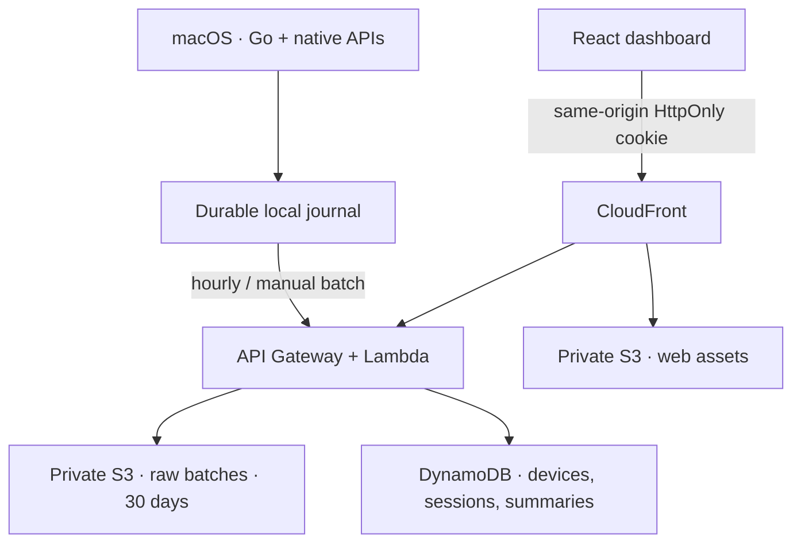

# Architecture and data access

## Boundaries

The agent records only the foreground app, UTC timestamps and deliberate idle intervals. It never reads keystrokes, screenshots, titles, documents, messages, URLs, clipboard or browser history. Input inactivity is a duration from the operating system.

Five minutes of inactivity retroactively replaces the unsettled tail with idle time starting at last input. Only settled intervals enter upload batches. Brief foreground switches are preserved. Sleep and unobserved downtime are excluded. A single process owns a private, atomically replaced journal; every observation is persisted before the next sample. Crashes may lose the last sampling interval, never an entire day's committed data.

## DynamoDB access patterns

One table, no secondary indexes. All access is by known partition key and optional sort-key range.

| Access | PK | SK |
| --- | --- | --- |
| Authenticate device; get last sync | DEVICE#id | META |
| Redeem one-time token | PAIR#sha256(token) | TOKEN |
| Authenticate browser | BROWSER#sha256(token) | SESSION |
| Check batch receipt | DEVICE#id | BATCH#batch-id |
| Recompute a day from retained intervals | DEVICE#id | INTERVAL#UTC-start#id |
| Read/write derived calendar summary | DEVICE#id | DAY#timezone#YYYY-MM-DD |

A batch has at most 90 intervals, each at most 24 hours. Raw S3 is written before a transaction atomically creates the receipt and intervals and updates last sync. Failed transactions leave harmless raw objects; retries use the same object key and batch identity. A reused batch ID with a different content hash is rejected. Session IDs cannot be reused in a different batch. Batch receipt and interval TTLs are 30 days; requests older than retention are rejected even if DynamoDB has not removed expired items. Daily summaries have 365-day TTL and are a cache, never the source of truth. Timezone-specific summaries are recomputed from retained intervals when requested. Beyond raw retention only previously computed summaries are available.

Pairing tokens expire after ten minutes and are consumed transactionally with browser session creation. Browser sessions expire after 30 days. DynamoDB TTL is cleanup only: expiry is enforced in application code.

## Security and retention

Device secrets stay in macOS Keychain. The backend stores their hashes. A pairing link carries only a random, short-lived one-time token in its fragment; the browser removes it immediately and exchanges it via POST. Cookies are Secure, HttpOnly and SameSite=Strict. The dashboard and API share one CloudFront origin. Mutation requests from browsers require matching Origin. Pairing is possession-based: anyone with the unredeemed link can pair; keep it private. Multiple browsers can pair independently. Clearing the cookie disconnects that browser; removing local credentials does not erase cloud history.

Thirty days of raw records allows debugging/recomputation without an indefinite detailed activity archive. Cached daily summaries expire after one year. The public registration endpoint is throttled; deployers should monitor abuse and AWS cost. AWS resources are defined with Terraform, but deployment requires explicit configuration and credentials.

## Known limitations and v2

Long videos without input can appear idle. Foreground sampling may miss transitions shorter than the sampling interval. An offline device cannot update the hosted dashboard. Historical timezone changes cannot reconstruct unretained raw activity. V2 is limited to a Chrome extension, Windows support, and Linux support.
